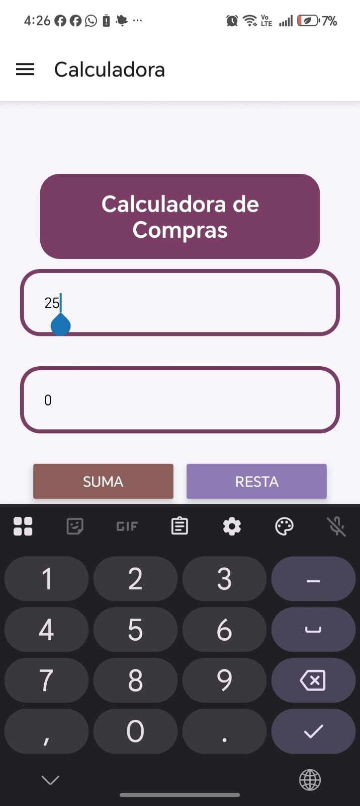

# Lectura de código — Calculadora y Estilos

## Cómo leer este documento
Cada sección explica un archivo línea por línea. La idea es que puedas leer cualquier parte del código y entender exactamente qué hace y por qué está ahí.

---

## `colors.js` — La paleta de colores
```javascript
export const colors = {
    primary:  '#7A3E65',  // morado principal
    background:'#F8F5FA', // fondo general
    white:    '#ffffff',
    black:    '#000000',
    error:    '#ca2222',
    btnRed:   '#a94630',
    ...
};
```

**`export const`** → hace que este objeto esté disponible para importarlo en cualquier otro archivo.

**`colors.primary`** → en lugar de escribir `'#7A3E65'` en 10 archivos distintos, lo escribes una vez aquí y en todos lados usas `colors.primary`. Si el color cambia, solo se toca esta línea.

**Los `btn*`** → son los colores específicos de cada botón. Cada uno tiene un nombre descriptivo para saber a qué botón corresponde sin memorizar el código hex.

---

## `spacing.js` — Márgenes y tamaños

```javascript
export const spacing = {
    xs:  5,
    sm:  10,
    md:  20,   // el más usado, equivale a un margen normal
    lg:  30,
    xl:  40,
    xxl: 50,

    borderRadius: {
        sm:   10,
        md:   14,
        lg:   18,
        card: 20,  // el redondeo de las tarjetas de producto
    },

    card: {
        padding:      10,
        marginBottom: 20,
    },
};
```

**¿Por qué existe?** → Sin esto, en cada pantalla aparecen números sueltos como `padding: 20` o `borderRadius: 20`. Si el diseño cambia a `padding: 16`, habría que buscarlo en todos los archivos. Con spacing, se cambia `md: 16` y se aplica en toda la app.

**Cómo se usa en el código:**
```javascript
// En lugar de esto:
padding: 20,
borderRadius: 20,

// Se escribe esto:
padding: spacing.md,
borderRadius: spacing.borderRadius.card,
```

---

## `typography.js` — Tamaños de texto

```javascript
export const typography = {
    title:    { fontSize: 22, fontWeight: 'bold' },
    subtitle: { fontSize: 20, fontWeight: 'bold' },
    label:    { fontSize: 16, fontWeight: '600' },
    body:     { fontSize: 16 },
    price:    { fontSize: 18, fontWeight: 'bold' },
    section:  { fontSize: 22, fontWeight: '800' },
};
```

**`fontSize`** → tamaño del texto en píxeles.

**`fontWeight`** → grosor del texto. `'bold'` es negrita normal, `'800'` es negrita más gruesa, `'600'` es semibold (entre normal y negrita).

**Cómo se usa:**
```javascript
// En lugar de repetir fontSize y fontWeight en cada pantalla:
<Text style={typography.title}>Calculadora</Text>
```

---

## `useCalculator.js` — La lógica de la calculadora

```javascript
export function useCalculator() {
```
Es un **custom hook**. Empieza con `use` para que React sepa que puede usar otros hooks adentro. Lo que devuelve lo puede usar cualquier pantalla.

```javascript
    const [cantidad,  setCantidad]  = useState('');
    const [precio,    setPrecio]    = useState('');
    const [resultado, setResultado] = useState(null);
    const [error,     setError]     = useState('');
```
**`useState`** guarda valores que cambian cuando el usuario interactúa. Cada `useState` devuelve dos cosas: el valor actual y la función para cambiarlo.
- `cantidad` → lo que el usuario escribió en el primer campo
- `precio` → lo que escribió en el segundo campo
- `resultado` → el número que sale después de operar
- `error` → el mensaje de error si algo está mal

```javascript
    const calcular = (operacion) => {
        setError('');
```
Cada vez que se presiona un botón, primero borra el error anterior.

```javascript
        if (!cantidad || !precio) {
            setError('Por favor, ingrese ambos valores.');
            return;
        }
```
**`!cantidad`** → si el campo está vacío, es `true`. Si alguno está vacío, muestra el error y para (`return`).

```javascript
        const can = parseFloat(cantidad);
        const pr  = parseFloat(precio);
```
**`parseFloat`** → convierte el texto que escribió el usuario (`"25"`) a número real (`25`). Sin esto no se puede operar matemáticamente.

```javascript
        if (isNaN(can) || isNaN(pr)) {
```
**`isNaN`** → "is Not a Number". Si el usuario escribió letras en vez de números, `parseFloat` devuelve `NaN` y esto lo detecta.

```javascript
        if (operacion === 'dividir' && pr === 0) {
            setError('No se puede dividir por cero.');
            return;
        }
```
Validación especial: dividir entre cero es matemáticamente imposible, se corta antes de intentarlo.

```javascript
        switch (operacion) {
            case 'suma':        res = can + pr; break;
            case 'resta':       res = can - pr; break;
            case 'multiplicar': res = can * pr; break;
            case 'dividir':     res = can / pr; break;
        }
```
**`switch`** → es como varios `if` encadenados. Según qué botón presionó el usuario (`'suma'`, `'resta'`, etc.), ejecuta la operación correspondiente. El `break` evita que siga ejecutando los casos siguientes.

```javascript
    return { cantidad, setCantidad, precio, setPrecio, resultado, error, calcular };
```
Devuelve todo lo que la pantalla necesita. La pantalla no sabe cómo funciona la lógica, solo pide los valores y los muestra.

---

## `CalculatorButton.js` — El botón de la calculadora

```javascript
export default function CalculatorButton({ title, color, onPress }) {
    return (
        <View style={styles.container}>
            <AppButton title={title} color={color} onPress={onPress} />
        </View>
    );
}

const styles = StyleSheet.create({
    container: { width: 140 },
});
```

**¿Por qué existe si ya hay `AppButton`?**

Porque en la calculadora cada botón necesita estar dentro de un `View` con `width: 140`. Sin este componente, `CalculatorScreen` tendría que repetir ese `View` 4 veces. Con `CalculatorButton`, ese detalle vive en un solo lugar.

**`{ title, color, onPress }`** → son las **props**, los datos que le pasa quien usa el componente. El botón no sabe qué texto tiene ni qué hace, eso se lo dice quien lo usa.

---

## `CalculatorScreen.js` — La pantalla

```javascript
const { cantidad, setCantidad, precio, setPrecio, resultado, error, calcular } = useCalculator();
```
**Destructuring**: extrae cada valor del hook en variables separadas. Es equivalente a:
```javascript
const todo = useCalculator();
const cantidad = todo.cantidad;
// ... etc
```

```javascript
<TextInput
    placeholder="Cantidad"
    value={cantidad}
    keyboardType="numeric"
    onChangeText={setCantidad}
/>
```
- **`value={cantidad}`** → el campo muestra lo que hay en el estado `cantidad`
- **`keyboardType="numeric"`** → abre el teclado numérico en el celular
- **`onChangeText={setCantidad}`** → cada vez que el usuario escribe, actualiza el estado `cantidad`

```javascript
<CalculatorButton title="Suma" color={colors.btnWine} onPress={() => calcular('suma')} />
```
- **`onPress={() => calcular('suma')}`** → cuando se presiona, llama a `calcular` con el string `'suma'`, que el hook procesa en el `switch`

```javascript
{error ? <Text style={styles.error}>{error}</Text> : null}
{resultado !== null ? <Text style={styles.result}>Resultado: {resultado}</Text> : null}
```
**Renderizado condicional**: si `error` tiene texto, muestra el mensaje. Si no, muestra `null` (nada). Lo mismo con `resultado`, pero se compara con `null` porque `0` también es un resultado válido y `!0` sería `true`, lo que ocultaría el cero.

---

## Flujo completo de la calculadora

```
Usuario escribe "5" en Cantidad
    → onChangeText dispara setCantidad('5')
    → el estado cantidad cambia a '5'
    → TextInput se actualiza mostrando '5'

Usuario presiona "Suma"
    → onPress llama calcular('suma')
    → useCalculator valida los campos
    → parseFloat convierte '5' y '3' a números
    → ejecuta 5 + 3 = 8
    → setResultado(8)
    → CalculatorScreen re-renderiza mostrando "Resultado: 8"
```



