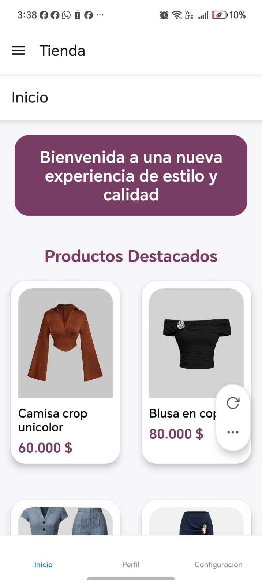

# Lectura de código — Navegación

La navegación está dividida en 4 archivos. Cada uno tiene una sola responsabilidad y juntos forman la estructura completa de rutas de la app.

---

## Cómo se conectan los 4 archivos

```
App.js
  └── AppNavigation          → envuelve todo en NavigationContainer
        └── StackNavigation  → controla las pantallas con transición de pila
              └── DrawerNavigation  → menú lateral (Tienda, Calculadora)
                    └── TabNavigation  → pestañas inferiores (Inicio, Perfil, Ajustes)
```

Cada nivel envuelve al siguiente. El usuario ve solo la pantalla del nivel más interno.

---

## `AppNavigation.js` — El contenedor raíz

```javascript
import { NavigationContainer } from '@react-navigation/native';
import StackNavigation from './StackNavigation';

export default function AppNavigation() {
    return (
        <NavigationContainer>
            <StackNavigation />
        </NavigationContainer>
    );
}
```

**`NavigationContainer`** → es el componente que mantiene el estado de toda la navegación (qué pantalla está activa, el historial de pantallas visitadas). Solo puede haber uno en toda la app y debe envolver todo lo demás.

**¿Por qué este archivo no hace más?** → principio de responsabilidad única. Su único trabajo es proveer el contenedor. Todo lo demás lo delega a `StackNavigation`.

---

## `StackNavigation.js` — La pila de pantallas

```javascript
const Stack = createNativeStackNavigator();
```
Crea el navegador de pila. Una pila funciona como una torre de cartas: cada pantalla nueva se apila encima de la anterior, y el botón "atrás" quita la carta de arriba.

```javascript
<Stack.Screen name="Shop"    component={SplashScreen} />
<Stack.Screen name="MainTab" component={DrawerNavigation} options={{ headerShown: false }} />
<Stack.Screen name="Detail"  component={DetailScreen} options={{ title: 'Detalle del producto' }} />
```

**`name`** → el identificador de la pantalla. Es el string que se usa en `navigation.navigate('Detail')`. Si el nombre aquí dice `'Detail'` pero en el navigate dice `'Detalle'`, no encuentra la pantalla.

**`component`** → qué renderizar cuando se navega a esa pantalla. Puede ser una pantalla o incluso otro navegador completo (como `DrawerNavigation`).

**`options={{ headerShown: false }}`** → oculta la barra de título superior. Se usa en `MainTab` para que el Drawer y el Tab manejen su propio encabezado sin duplicar barras.

**`options={{ title: 'Detalle del producto' }}`** → cambia el texto que aparece en la barra superior de esa pantalla.

**¿Por qué están registradas pantallas que ya están en el Tab?** → porque el Stack es la capa base. Si en algún momento se necesita navegar directamente a `ProfileScreen` desde cualquier parte de la app (sin pasar por el Tab), el Stack lo permite.

---

## `DrawerNavigation.js` — El menú lateral

```javascript
const Drawer = createDrawerNavigator();

export default function DrawerNavigation() {
    return (
        <Drawer.Navigator>
            <Drawer.Screen name="Tienda"      component={TabNavigation} />
            <Drawer.Screen name="Calculadora" component={CalculatorScreen} />
        </Drawer.Navigator>
    );
}
```

**`createDrawerNavigator`** → crea un menú que se desliza desde el lado izquierdo de la pantalla. Para abrirlo el usuario desliza el dedo desde el borde izquierdo o presiona el ícono de hamburguesa (≡).

**`Tienda` apunta a `TabNavigation`** → no apunta a una pantalla, apunta a otro navegador completo. Esto es la navegación anidada: el Drawer contiene al Tab, que a su vez contiene las pantallas de Inicio, Perfil y Ajustes.

**`Calculadora` apunta a `CalculatorScreen`** → esta pantalla es accesible solo desde el menú lateral, no aparece en las pestañas inferiores.

Visualmente el menú lateral muestra:
```
≡ Tienda        → abre Inicio / Perfil / Ajustes
≡ Calculadora   → abre la calculadora
```

---

## `TabNavigation.js` — Las pestañas inferiores

```javascript
const Tab = createBottomTabNavigator();

export default function TabNavigation() {
    return (
        <Tab.Navigator screenOptions={{ headerShown: false }}>
            <Tab.Screen name="Inicio"   component={HomeScreen} />
            <Tab.Screen name="Perfil"   component={ProfileScreen} />
            <Tab.Screen name="Ajustes"  component={SettingsScreen} />
        </Tab.Navigator>
    );
}
```

**`createBottomTabNavigator`** → crea la barra de pestañas que aparece fija en la parte inferior de la pantalla. El usuario puede cambiar entre pantallas tocando cada pestaña sin perder el estado de las otras.

**`screenOptions={{ headerShown: false }}`** → se aplica a todas las pestañas a la vez. Sin esto, cada pantalla dentro del Tab mostraría su propio encabezado y además el Drawer mostraría el suyo, resultando en dos barras apiladas.

**¿Por qué `TabNavigation` está dentro de `DrawerNavigation` y no al revés?** → porque el menú lateral es la navegación de nivel superior. El Tab vive dentro de la opción "Tienda" del Drawer. Si fuera al revés, el Drawer aparecería dentro de las pestañas, lo que no tiene sentido visualmente.

---

## Resumen del flujo de navegación

```
Abre la app
  → SplashScreen (5 segundos)
  → navega a MainTab (DrawerNavigation)
        → muestra TabNavigation (pestaña Inicio por defecto)
              → usuario toca un producto
              → navega a DetailScreen (Stack)
              → usuario presiona atrás
              → vuelve a HomeScreen
        → usuario desliza desde la izquierda
        → abre el Drawer
        → elige Calculadora
        → navega a CalculatorScreen
```

