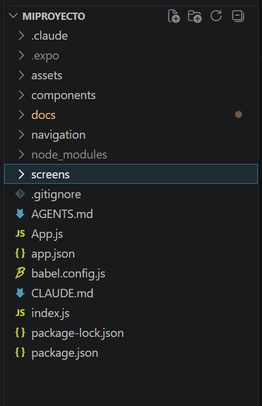
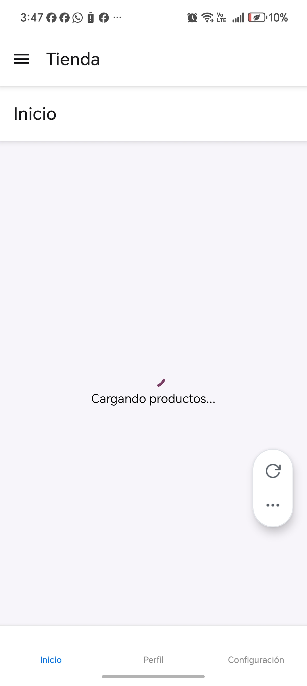
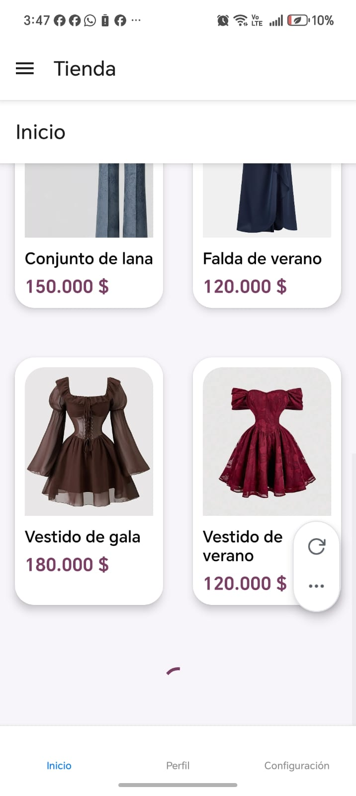
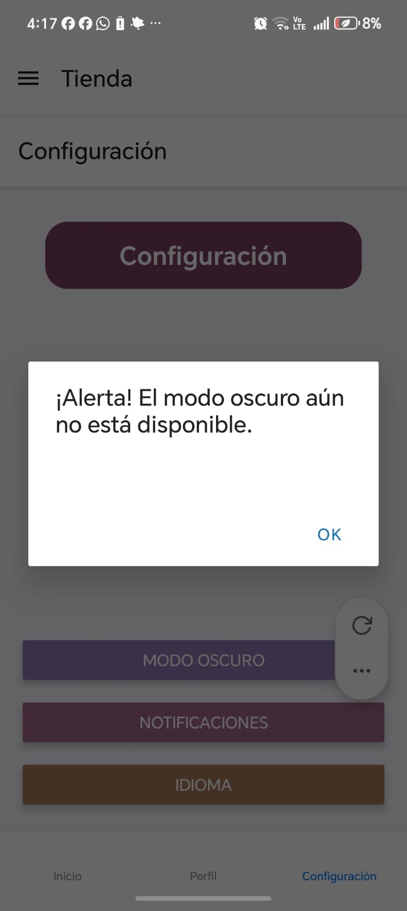
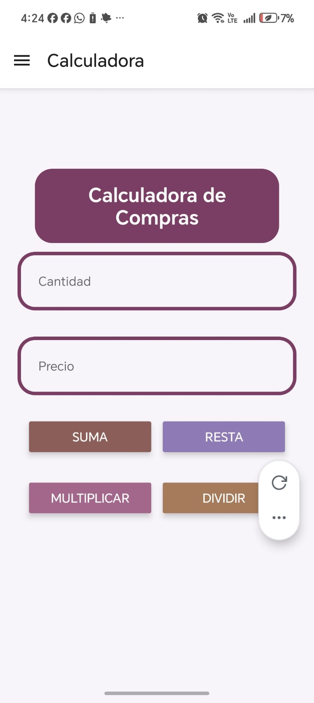
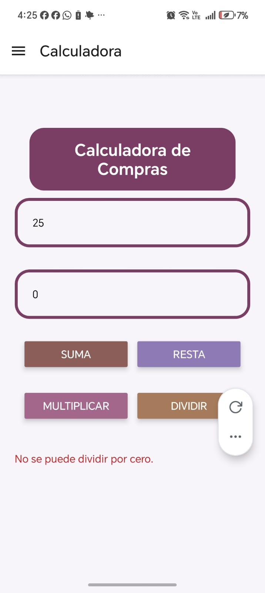
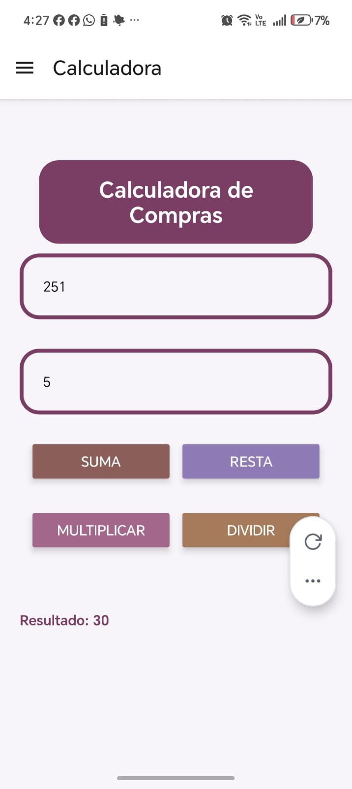
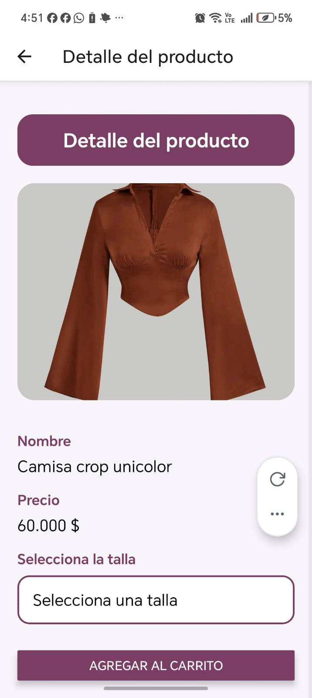
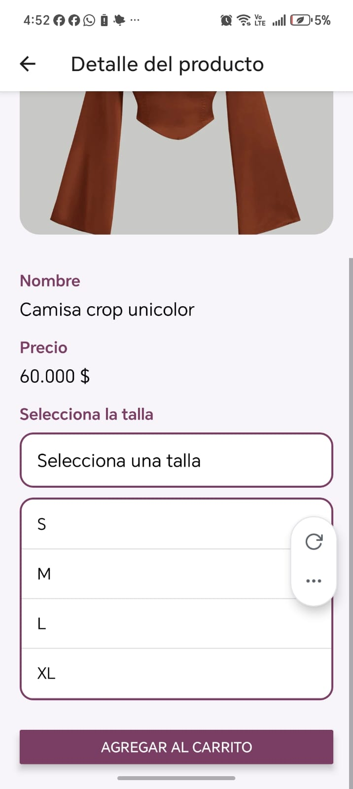

# StyleShop - Explicación del Proyecto

## 1. Introducción

### 1.1 Objetivo de la aplicación

Describir el propósito de la aplicación móvil StyleShop, desarrollada como práctica de aprendizaje en React Native, implementando componentes interactivos, navegación entre pantallas y funcionalidades básicas para la gestión visual de productos de ropa femenina.

### 1.2 Tecnologías utilizadas

Presentar las herramientas y tecnologías empleadas durante el desarrollo:

- React Native
- Expo SDK 54
- JavaScript
- React Navigation
- Node.js
- Visual Studio Code
- Android Studio (emulador y pruebas)

---

## 2. Estructura General del Proyecto

### 2.1 Organización de carpetas

Explicar la estructura utilizada para mantener el proyecto organizado y facilitar el mantenimiento del código:

- assets/ → Imágenes e íconos de la aplicación.
- components/ → Componentes reutilizables como ProductCard.
- navigation/ → Configuración de Stack Navigation, Bottom Tabs y Drawer Navigation.
- screens/ → Pantallas principales de la aplicación.
- App.js → Punto de entrada principal.



### 2.2 Flujo general de la aplicación

Describir el recorrido que realiza el usuario dentro de la aplicación:

- Inicio en la pantalla Splash (LagePage).
- Redirección automática a la pantalla principal.
- Acceso al menú lateral (Drawer Navigation).
 Navegación entre Home, Perfil
 - Configuración, Calculadora y Detalle.
- Visualización de productos mediante ScrollView.
- Selección de productos para consultar información detallada.
- Uso de componentes interactivos como botones, modal, picker y calculadora

---

## 3. Pantallas Implementadas

### 3.1 Pantalla de Inicio (Home)
## 3.1 Pantalla de Inicio (Home)

La pantalla Home se encuentra en el componente `StyleShop`. Esta pantalla es la encargada de mostrar los productos disponibles y permitir la navegación hacia la pantalla de detalle.

### Importación de dependencias

Al inicio del archivo se importan los componentes y hooks necesarios para el funcionamiento de la pantalla.

```javascript
import React from 'react';
import { useState } from 'react';
import { useEffect } from 'react';
```

* **React** permite crear componentes.
* **useState** permite almacenar valores que pueden cambiar durante la ejecución.
* **useEffect** permite ejecutar acciones cuando la pantalla se carga.

También se importan componentes visuales de React Native:

```javascript
import { View, Text, StyleSheet, ScrollView, ActivityIndicator } from 'react-native';
```

Cada uno cumple una función específica dentro de la interfaz.

### Carga de imágenes

Las imágenes de los productos se cargan mediante la función `require()`.

```javascript
const icon = require('../assets/blusa1.png');
```

Este proceso permite acceder a los archivos almacenados dentro de la carpeta `assets`.


### Creación de los productos

Los productos se almacenan dentro de arreglos de objetos.

```javascript
const productosInicio = [
    {
        id: 1,
        imagen: icon,
        nombre: 'Camisa crop unicolor',
        precio: '60.000 $'
    }
];
```

Cada objeto contiene la información que será mostrada en las tarjetas de productos.

### Manejo de estados

Se utilizan dos estados para controlar los tiempos de carga.

```javascript
const [loading, setLoading] = useState(true);
const [loading1, setLoading1] = useState(true);
```

Inicialmente ambos estados tienen el valor `true`, indicando que la información aún se encuentra cargando.

### Uso de useEffect

Los hooks `useEffect` ejecutan temporizadores mediante `setTimeout`.

```javascript
useEffect(() => {
    setTimeout(() => {
        setLoading(false);
    }, 3000);
}, []);
```

Cuando transcurren tres segundos, el estado cambia a `false` y se muestra el contenido principal de la pantalla.

### Indicador de carga

Mientras el estado `loading` sea verdadero, se muestra un indicador de carga.

```javascript
<ActivityIndicator size="large" color="#7A3E65" />
```

Este componente informa al usuario que la información se encuentra procesándose.



### Uso de ScrollView

El componente `ScrollView` permite desplazarse verticalmente cuando el contenido supera el tamaño de la pantalla.

```javascript
<ScrollView>
```

Gracias a esto todos los productos pueden visualizarse correctamente.

### Renderizado dinámico de productos

Para mostrar las tarjetas se utiliza el método `map()`.

```javascript
productosInicio.map((producto) => (
    <ProductCard />
))
```

Este método recorre todos los elementos del arreglo y crea una tarjeta para cada producto.



### Navegación entre pantallas

Cuando el usuario selecciona una tarjeta se ejecuta:

```javascript
navigation.navigate('Detail')
```

Este método pertenece a React Navigation y permite cambiar a la pantalla de detalle enviando la información del producto seleccionado.


### Estilos

Los estilos se organizan mediante `StyleSheet.create()`.

```javascript
const style = StyleSheet.create({
    container: {
        justifyContent: 'center',
        alignItems: 'center'
    }
});
```

Esta estructura mejora la organización del código y facilita el mantenimiento de la interfaz.

### Resumen

La pantalla Home implementa el uso de estados, efectos, renderizado dinámico de datos, indicadores de carga, desplazamiento mediante ScrollView y navegación entre pantallas, integrando varios conceptos fundamentales de React Native.


### 3.2 Pantalla de Perfil
## 3.2 Pantalla de Perfil

La pantalla **Perfil** permite visualizar la información básica del usuario, como su nombre, correo electrónico e imagen de perfil. Además, incorpora un **Modal** para cumplir con el requisito de Dialog/Modal solicitado en la actividad.

### Funcionamiento del código

Para construir esta pantalla se utilizan componentes de React Native como:

- `View`: contenedor principal de los elementos.
- `ScrollView`: permite desplazarse verticalmente si el contenido supera el tamaño de la pantalla.
- `Text`: muestra textos e información.
- `Image`: presenta la fotografía o avatar del usuario.
- `Button`: ejecuta acciones al ser presionado.
- `Modal`: muestra una ventana emergente sobre la pantalla actual.
- `Alert`: despliega mensajes informativos.


### Manejo del estado

Se utiliza el Hook `useState` para controlar la visibilidad del Modal.

```javascript
const [modalVisible, setModalVisible] = useState(false);
```


### Implementación del Modal

El componente **Modal** se utiliza para mostrar una ventana emergente sobre la pantalla actual. En este proyecto se implementó para simular la opción **Editar Perfil**, permitiendo abrir y cerrar un cuadro informativo mediante botones.

```javascript
<Modal
    visible={modalVisible}
    animationType="slide"
    transparent={true}
    onRequestClose={() => setModalVisible(false)}
>
```

## Propiedades utilizadas

| Propiedad | Función |
|---|---|
| `visible` | Controla si el Modal se muestra o no. |
| `animationType` | Define la animación de apertura. |
| `transparent` | Permite ver parcialmente el fondo. |
| `onRequestClose` | Permite cerrar el Modal desde Android. |
### 3.3 Pantalla de Configuración

# SettingsScreen — Documentación

## Descripción general

`SettingsScreen` es una pantalla de configuración construida con **React Native**. Muestra un encabezado con título, una imagen de logo y un grupo de botones con acciones simuladas mediante alertas.

---

## Importaciones

```javascript
import { Text, ScrollView, Image, StyleSheet, Button, Alert, View } from 'react-native';
import React from 'react';
```

| Componente / Módulo | Uso |
|---|---|
| `Text` | Renderiza el título "Configuración" |
| `ScrollView` | Permite hacer scroll en la pantalla |
| `Image` | Muestra el logo de la app |
| `StyleSheet` | Define los estilos de forma optimizada |
| `Button` | Botones de acción (Modo oscuro, Notificaciones, Idioma) |
| `Alert` | Muestra alertas nativas al presionar los botones |
| `View` | Contenedor principal y agrupador de botones |
| `React` | Necesario para usar JSX |


---

## Props recibidas

```javascript
export default function SettingsScreen({ navigation }) { ... }
```

| Prop | Tipo | Descripción |
|---|---|---|
| `navigation` | `object` | Objeto de React Navigation. Aunque se recibe, en este componente no se usa directamente. |

---

## Lógica interna

### Carga del ícono

```javascript
const icon = require('../assets/logo.png');
```

Se carga la imagen del logo de forma estática desde la carpeta `assets`. Se usa `require` en lugar de una URL para que el bundler de React Native la incluya en el build.

---

## Estructura JSX

```jsx
<View style={{ flex: 1, backgroundColor: '#F8F5FA' }}>
    <ScrollView ...>
        <Text ...>Configuración</Text>
        <Image style={styles.Image} source={icon} />
        <View style={styles.Button}>
            <Button title='Modo oscuro' ... />
            <Button title='Notificaciones' ... />
            <Button title='Idioma' ... />
        </View>
    </ScrollView>
</View>
```

| Elemento | Función |
|---|---|
| `View` externo | Ocupa toda la pantalla (`flex: 1`) con fondo claro |
| `ScrollView` | Permite scroll vertical si el contenido supera la pantalla |
| `Text` | Título estilizado con fondo morado y bordes redondeados |
| `Image` | Muestra el logo centrado debajo del título |
| `View` (botones) | Agrupa los tres botones con separación entre ellos (`gap: 20`) |

### Comportamiento de los botones

| Botón | Color | Acción |
|---|---|---|
| Modo oscuro | `#8E7AB5` (lila) | Alerta: función aún no disponible |
| Notificaciones | `#A2678A` (rosado) | Alerta: notificaciones desactivadas |
| Idioma | `#A67B5B` (café) | Alerta: solo disponible en español |

> Todos los botones usan `Alert.alert()` como respuesta simulada, indicando que las funciones no están implementadas todavía.



---

## Estilos (`StyleSheet`)

### `container`
```javascript
container: {
    padding: 20,
    backgroundColor: '#F8F5FA',
    paddingBottom: 50,
}
```
Define el espaciado interno del `ScrollView`. El `paddingBottom` extra evita que el último elemento quede pegado al borde inferior.

---

### `Image`
```javascript
Image: {
    width: 200,
    height: 200,
    alignSelf: 'center',
    marginTop: 70,
    marginBottom: 20,
}
```
Centra el logo horizontalmente y le da espacio vertical respecto al título y los botones.

---

### `TexsName` ⚠️
```javascript
TexsName: {
    fontSize: 16,
    fontWeight: '600',
    color: '#000000',
    marginTop: 20,
}
```
> **Nota:** Este estilo está definido pero **no se usa** en ningún lugar del JSX. Probablemente es un remanente de una versión anterior del componente.

---

### `Button`
```javascript
Button: {
    marginTop: 20,
    gap: 20,
}
```
Aplica margen superior al grupo de botones y una separación uniforme entre ellos usando `gap`.

---

## Paleta de colores

| Color | Código | Uso |
|---|---|---|
| Fondo general | `#F8F5FA` | Fondo de pantalla y ScrollView |
| Título | `#7A3E65` | Fondo del texto "Configuración" |
| Botón Modo oscuro | `#8E7AB5` | Color del botón |
| Botón Notificaciones | `#A2678A` | Color del botón |
| Botón Idioma | `#A67B5B` | Color del botón |

### 3.4 Pantalla de Calculadora

# CalculadoraScreen — Documentación

## Descripción general

`CalculadoraScreen` es una pantalla de calculadora de compras. El usuario ingresa una **cantidad** y un **precio**, luego elige una operación matemática. El resultado se muestra en pantalla o, si hay un error, se muestra un mensaje descriptivo.

---

## Importaciones

```javascript
import React, { useState } from "react";
import { View, Text, StyleSheet, TextInput, Button } from 'react-native';
```

| Módulo | Uso |
|---|---|
| `React` | Necesario para usar JSX |
| `useState` | Maneja los estados locales del componente |
| `View`, `Text`, `TextInput`, `Button` | Componentes visuales de React Native |



---

## Estados (`useState`)

```javascript
const [cantidad, setCantidad] = useState("");
const [precio, setPrecio] = useState("");
const [resultado, setResultado] = useState(null);
const [error, setError] = useState("");
```

| Estado | Valor inicial | Descripción |
|---|---|---|
| `cantidad` | `""` | Guarda lo que el usuario escribe en el campo "Cantidad" |
| `precio` | `""` | Guarda lo que el usuario escribe en el campo "Precio" |
| `resultado` | `null` | Guarda el resultado de la operación. Empieza en `null` para saber si aún no se ha calculado nada |
| `error` | `""` | Guarda el mensaje de error si los datos son inválidos |

---

## Función principal: `calcularTotal`

```javascript
const calcularTotal = (operacion) => { ... }
```

Recibe como parámetro un string con el nombre de la operación (`"suma"`, `"resta"`, `"multiplicar"`, `"dividir"`) y ejecuta los siguientes pasos:

### Paso 1 — Limpiar error anterior
```javascript
setError("");
```
Antes de validar, se borra cualquier error previo para que no quede visible si el nuevo intento es válido.

---

### Paso 2 — Validar que los campos no estén vacíos
```javascript
if (!cantidad || !precio) {
    setError("Por favor, ingrese ambos valores.");
    return;
}
```
Si cualquiera de los dos campos está vacío, se muestra el error y se detiene la ejecución con `return`.

---

### Paso 3 — Convertir a números
```javascript
const can = parseFloat(cantidad);
const pr = parseFloat(precio);
```
Los valores de los `TextInput` siempre llegan como texto (`string`). `parseFloat` los convierte a número decimal para poder operar con ellos.

---

### Paso 4 — Validar que sean números válidos
```javascript
if (isNaN(can) || isNaN(pr)) {
    setError("Por favor, ingrese valores numéricos válidos.");
    return;
}

```

Si el usuario escribió algo que no se puede convertir a número (por ejemplo `"abc"`), `parseFloat` devuelve `NaN` (*Not a Number*). `isNaN()` detecta eso y muestra el error.

---

### Paso 5 — Validar división por cero
```javascript
if (operacion === "dividir" && pr === 0) {
    setError("No se puede dividir por cero.");
    return;
}
```


Solo aplica cuando la operación es `"dividir"`. Dividir entre cero en matemáticas es indefinido, por lo que se bloquea antes de intentarlo.

---

### Paso 6 — Ejecutar la operación con `switch`
```javascript
let res = 0;
switch (operacion) {
    case "suma":       res = can + pr;  break;
    case "resta":      res = can - pr;  break;
    case "multiplicar":res = can * pr;  break;
    case "dividir":    res = can / pr;  break;
    default: return;
}
setResultado(res);
```

| Operación | Cálculo | Ejemplo (can=10, pr=2) |
|---|---|---|
| `suma` | `can + pr` | `10 + 2 = 12` |
| `resta` | `can - pr` | `10 - 2 = 8` |
| `multiplicar` | `can * pr` | `10 * 2 = 20` |
| `dividir` | `can / pr` | `10 / 2 = 5` |


El `default` con `return` actúa como protección: si por alguna razón llega una operación desconocida, no hace nada. Al final, `setResultado(res)` guarda el resultado en el estado para que se muestre en pantalla.


---

## Renderizado condicional

```jsx
{error ? <Text style={styles.error}>{error}</Text> : null}
{resultado !== null ? <Text style={styles.result}>Resultado: {resultado}</Text> : null}
```

| Condición | Qué muestra |
|---|---|
| `error` tiene texto | Mensaje de error en rojo |
| `resultado` no es `null` | El resultado de la operación |
| Ambos vacíos (inicio) | Nada extra en pantalla |

> Se usa `resultado !== null` (y no solo `resultado`) porque si el resultado fuera `0`, la condición `!resultado` lo trataría como falso y no lo mostraría. Con `!== null` se garantiza que el `0` también se renderice correctamente.

---

## Flujo completo resumido

```
Usuario escribe Cantidad y Precio
        ↓
Presiona un botón de operación
        ↓
calcularTotal("operacion")
        ↓
¿Campos vacíos?  → Error: "ingrese ambos valores"
        ↓
¿Son números?    → Error: "valores numéricos válidos"
        ↓
¿Divide por 0?   → Error: "no se puede dividir por cero"
        ↓
Ejecuta switch   → Guarda resultado en estado
        ↓
Pantalla muestra: "Resultado: X"
```

### 3.5 Pantalla de Detalle de Producto

# StyleShop — Flujo completo de pantallas

## Visión general del flujo

Estos tres archivos trabajan juntos para mostrar un catálogo de ropa y permitir ver el detalle de cada producto:

```
StyleShop (pantalla principal)
    └── ProductCard (componente reutilizable de tarjeta)
            └── Al presionar → navega a DetailScreen con los datos del producto
```

---

## 1. `StyleShop.jsx` — Pantalla principal del catálogo

### Estados y hooks

```javascript
const [loading, setLoading] = useState(true);
const [loading1, setLoading1] = useState(true);
```

| Estado | Descripción |
|---|---|
| `loading` | Controla si la **primera sección** de productos sigue cargando |
| `loading1` | Controla si la **segunda sección** de productos sigue cargando |

Los dos se inician en `true` (cargando) y se cambian a `false` con un `setTimeout` dentro de `useEffect`.

---

### ¿Cómo funciona `useEffect` aquí?

```javascript
useEffect(() => {
    setTimeout(() => {
        setLoading(false);
    }, 3000);
}, []);

useEffect(() => {
    setTimeout(() => {
        setLoading1(false);
    }, 8000);
}, []);
```

- El `[]` al final significa que cada `useEffect` se ejecuta **una sola vez**, justo cuando el componente se monta en pantalla.
- El primero espera **3 segundos** y luego muestra la primera sección de productos.
- El segundo espera **8 segundos** y luego muestra la segunda sección, simulando una carga más lenta (como si viniera de una API).
- Mientras `loading` es `true`, se muestra un `ActivityIndicator` en el centro de la pantalla en lugar del contenido.

---

### Listas de productos

```javascript
const productosInicio = [
    { id: 1, imagen: icon, nombre: 'Camisa crop unicolor', precio: '60.000 $' },
    ...
];

const productosMas = [
    { id: 7, imagen: icon7, nombre: 'Conjunto elegante', precio: '60.000 $' },
    ...
];
```

- Son arreglos de objetos definidos directamente en el componente.
- Cada objeto tiene: `id`, `imagen` (referencia local con `require`), `nombre` y `precio`.
- `productosInicio` se muestra en cuanto termina el primer loading (3s).
- `productosMas` se muestra cuando termina el segundo loading (8s).

---

### Renderizado condicional de las dos secciones

```javascript
// Primera sección — bloquea toda la pantalla mientras carga
if (loading) {
    return (
        <ActivityIndicator size="large" color="#7A3E65" />
    )
}

// Segunda sección — solo bloquea su espacio en pantalla
{loading1 ? (
    <ActivityIndicator size="large" color="#7A3E65" />
) : (
    <View>
        {productosMas.map(...)}
    </View>
)}
```

La diferencia clave:
- `loading` usa un `if` que **reemplaza toda la pantalla** con el spinner.
- `loading1` usa un ternario dentro del JSX que solo **reemplaza esa sección**, dejando visible el resto del contenido.

---

### Cómo se renderizan las tarjetas con `.map()`

```javascript
{productosInicio.map((producto) => (
    <ProductCard
        key={producto.id}
        imagen={producto.imagen}
        nombre={producto.nombre}
        precio={producto.precio}
        onPress={() => navigation.navigate('Detail', {
            nombre: producto.nombre,
            precio: producto.precio,
            imagen: producto.imagen,
        })}
    />
))}
```

- `.map()` recorre el arreglo y por cada producto crea un componente `<ProductCard>`.
- `key={producto.id}` es obligatorio en React cuando se renderizan listas: le permite identificar cada elemento de forma única para optimizar actualizaciones.
- `onPress` usa `navigation.navigate('Detail', { ... })` para ir a la pantalla de detalle **pasando los datos del producto** como parámetros.

---

## 2. `ProductCard.jsx` — Componente reutilizable de tarjeta

### Props que recibe

```javascript
export default function ProductCard({ imagen, nombre, precio, onPress }) { ... }
```

| Prop | Tipo | Viene de | Descripción |
|---|---|---|---|
| `imagen` | `require(...)` | `StyleShop` | Imagen local del producto |
| `nombre` | `string` | `StyleShop` | Nombre del producto |
| `precio` | `string` | `StyleShop` | Precio formateado del producto |
| `onPress` | `function` | `StyleShop` | Función que navega a `DetailScreen` |

Este componente **no tiene estado propio**. Solo recibe datos y los muestra. Es un componente "presentacional" o "tonto" (*dumb component*).

---

### Estructura JSX

```jsx
<Pressable onPress={onPress} style={style.card}>
    <Image style={style.Image} source={imagen} />
    <Text style={style.productName}>{nombre}</Text>
    <Text style={style.productPrice}>{precio}</Text>
</Pressable>
```

- `Pressable` envuelve toda la tarjeta para que sea tocable. Al presionarla, ejecuta `onPress`, que fue definida en `StyleShop` y navega al detalle.
- `Image` muestra la foto del producto.
- Los dos `Text` muestran el nombre y el precio.

---

### Por qué se usa `Pressable` y no `Button`

`Pressable` permite envolver **cualquier elemento visual** (imágenes, textos, views) y hacerlo tocable, dando control total sobre el diseño. `Button` solo muestra un botón nativo y no puede contener otros componentes dentro.

---

## 3. `DetailScreen.jsx` — Pantalla de detalle del producto

### Cómo recibe los datos

```javascript
export default function DetailScreen({ route }) {
    const { nombre = 'Producto', precio = '', imagen } = route.params || {};
```

- `route.params` contiene los datos que `StyleShop` envió al hacer `navigation.navigate('Detail', { ... })`.
- Se usa desestructuración con valores por defecto (`nombre = 'Producto'`) para evitar errores si por alguna razón los parámetros no llegaron.
- `|| {}` es una protección extra: si `route.params` fuera `undefined`, se usa un objeto vacío en su lugar y los valores por defecto actúan.

---


### Estados del selector de talla

```javascript
const [talla, setTalla] = useState('Selecciona una talla');
const [mostrarTallas, setMostrarTallas] = useState(false);

const tallas = ['S', 'M', 'L', 'XL'];
```

| Estado | Valor inicial | Descripción |
|---|---|---|
| `talla` | `'Selecciona una talla'` | Guarda la talla que el usuario eligió |
| `mostrarTallas` | `false` | Controla si el menú de tallas está visible o no |

`tallas` es un arreglo simple (no estado) porque sus valores nunca cambian.

---



### Lógica del dropdown de tallas

```javascript
// Botón que abre/cierra el menú
<Pressable onPress={() => setMostrarTallas(!mostrarTallas)}>
    <Text>{talla}</Text>
</Pressable>

// Lista de opciones (solo visible si mostrarTallas es true)
{mostrarTallas && (
    <View>
        {tallas.map((opcion) => (
            <Pressable key={opcion} onPress={() => {
                setTalla(opcion);          // Guarda la talla elegida
                setMostrarTallas(false);   // Cierra el menú
            }}>
                <Text>{opcion}</Text>
            </Pressable>
        ))}
    </View>
)}
```

- `!mostrarTallas` invierte el estado cada vez que se presiona: si estaba cerrado lo abre, si estaba abierto lo cierra.
- `mostrarTallas && (...)` es renderizado condicional: solo muestra el bloque si `mostrarTallas` es `true`.
- Al seleccionar una opción se guardan dos cosas a la vez: la talla elegida y el cierre del menú.

---

## Flujo completo de datos

```
StyleShop
│
│  Define productosInicio y productosMas (arreglos con id, imagen, nombre, precio)
│
└──► .map() crea un <ProductCard> por cada producto
         │
         │  Recibe: imagen, nombre, precio, onPress
         │
         └──► Al presionar la tarjeta:
                  navigation.navigate('Detail', { nombre, precio, imagen })
                          │
                          ▼
              DetailScreen
                  route.params → { nombre, precio, imagen }
                  Muestra imagen, nombre, precio
                  Permite seleccionar talla con dropdown
                  Botón "Agregar al carrito" (demostrativo)
```


## 5. Gestión de Estados y Eventos

### 5.1 useState

5.1 useState
Hook de React que guarda datos que pueden cambiar. Cuando el valor cambia, el componente se vuelve a renderizar automáticamente.
javascriptconst [cantidad, setCantidad] = useState("");
ParteDescripcióncantidadVariable que guarda el valor actualsetCantidadFunción para actualizar el valor""Valor inicial
Usado en la app para guardar: campos de texto, resultados, errores, tallas seleccionadas y estados de carga.


# 5. Gestión de Estados y Eventos

## 5.1 `useState`

Hook de React que guarda datos que pueden cambiar. Cuando el valor cambia, el componente se vuelve a renderizar automáticamente.

```javascript
const [cantidad, setCantidad] = useState("");
```

| Parte | Descripción |
|---|---|
| `cantidad` | Variable que guarda el valor actual |
| `setCantidad` | Función para actualizar el valor |
| `""` | Valor inicial |

Usado en la app para guardar: campos de texto, resultados, errores, tallas seleccionadas y estados de carga.

---

## 5.2 `useEffect`

Hook que ejecuta código cuando el componente se monta, actualiza o desmonta.

```javascript
useEffect(() => {
    setTimeout(() => setLoading(false), 3000);
}, []);
```

- El `[]` vacío indica que solo se ejecuta **una vez** al montar el componente.
- En la app se usa para simular tiempos de carga con `setTimeout`.

---

## 5.3 Evento `onPress`

Se dispara cuando el usuario toca un elemento. Equivalente al `onClick` de la web.

```javascript
<Button onPress={() => calcularTotal("suma")} />
<Pressable onPress={() => navigation.navigate('Detail', { ... })} />
```

Usado en botones de la calculadora, tarjetas de productos y selector de tallas.

---

## 5.4 Validaciones implementadas

En `CalculadoraScreen` se validan los datos antes de operar:

| Validación | Mensaje mostrado |
|---|---|
| Campos vacíos | `"Por favor, ingrese ambos valores."` |
| Texto no numérico | `"Por favor, ingrese valores numéricos válidos."` |
| División por cero | `"No se puede dividir por cero."` |

Cada validación usa `return` para detener la ejecución si no se cumple la condición.

---

# 6. Calculadora Básica

## 6.1 Captura de datos

```javascript
<TextInput keyboardType="numeric" onChangeText={setCantidad} />
<TextInput keyboardType="numeric" onChangeText={setPrecio} />
```

`TextInput` captura lo que escribe el usuario. `keyboardType="numeric"` abre el teclado numérico en el dispositivo. Los valores se guardan en estado con `setCantidad` y `setPrecio`.

---

## 6.2 Operaciones matemáticas

```javascript
switch (operacion) {
    case "suma":        res = can + pr;  break;
    case "resta":       res = can - pr;  break;
    case "multiplicar": res = can * pr;  break;
    case "dividir":     res = can / pr;  break;
}
```

Cada botón llama a `calcularTotal("operacion")` con el nombre de la operación. El `switch` ejecuta el cálculo correspondiente.

---

## 6.3 Validación de entradas

Los valores del `TextInput` llegan como `string`. Se convierten a número con `parseFloat` antes de operar:

```javascript
const can = parseFloat(cantidad);
const pr = parseFloat(precio);

if (isNaN(can) || isNaN(pr)) { ... } // Si no son números válidos
```

---

## 6.4 Visualización de resultados

```javascript
{error ? <Text style={styles.error}>{error}</Text> : null}
{resultado !== null ? <Text style={styles.result}>Resultado: {resultado}</Text> : null}
```

- Si hay error, se muestra en rojo.
- Si hay resultado, se muestra debajo de los botones.
- Se usa `!== null` para que el resultado `0` también se muestre correctamente.

---

# 7. Scroll Loading

## 7.1 Uso de `ScrollView`

Permite hacer scroll vertical cuando el contenido supera el tamaño de la pantalla. Se usa en `StyleShop`, `SettingsScreen` y `DetailScreen`.

```javascript
<ScrollView contentContainerStyle={styles.container}>
    {/* contenido largo */}
</ScrollView>
```

---

## 7.2 Uso de `ActivityIndicator`

Muestra un spinner nativo mientras el contenido carga.

```javascript
<ActivityIndicator size="large" color="#7A3E65" />
```

En la app hay dos tipos de uso:
- **Pantalla completa**: reemplaza toda la vista mientras carga la primera sección.
- **Inline**: aparece dentro del scroll mientras carga la segunda sección.

---

## 7.3 Simulación de carga con `useEffect`

```javascript
useEffect(() => {
    setTimeout(() => setLoading(false), 3000);   // Primera sección: 3s
}, []);

useEffect(() => {
    setTimeout(() => setLoading1(false), 8000);  // Segunda sección: 8s
}, []);
```

Simula que los productos tardan en llegar (como si vinieran de una API). La segunda sección tarda más para mostrar que el resto de la pantalla sigue funcionando mientras carga.

---

# 8. Navegación de la Aplicación

## 8.1 React Navigation

Librería externa que maneja la navegación entre pantallas en React Native. En esta app se usan tres tipos: Stack, Bottom Tabs y Drawer.

---

## 8.2 `NavigationContainer`

```javascript
<NavigationContainer>
    <Stack.Navigator>...</Stack.Navigator>
</NavigationContainer>
```

Es el contenedor raíz de toda la navegación. Debe envolver todos los navegadores. Se coloca una sola vez en `AppNavigation` y se exporta hacia `App.js`.

---

## 8.3 Stack Navigation

```javascript
const Stack = createNativeStackNavigator();

<Stack.Navigator>
    <Stack.Screen name="Shop" component={LagePages} />
    <Stack.Screen name="MainTab" component={DrawerNavigation} options={{ headerShown: false }} />
    <Stack.Screen name="Detail" component={DetailScreen} options={{ title: 'Detalle del producto' }} />
    ...
</Stack.Navigator>
```

Funciona como una **pila de pantallas**: cada pantalla nueva se apila sobre la anterior y el botón de atrás la saca. Se usa para navegar entre la tienda, el detalle del producto y las demás pantallas.

| Pantalla | Nombre de ruta |
|---|---|
| Página de inicio | `"Shop"` |
| Drawer + Tabs | `"MainTab"` |
| Detalle producto | `"Detail"` |
| Calculadora | `"Calcula"` |
| Perfil | `"Mi perfil"` |
| Configuración | `"Configuración"` |

---

## 8.4 Bottom Tab Navigation

```javascript
const Tab = createBottomTabNavigator();

<Tab.Navigator>
    <Tab.Screen name="Inicio" component={StyleShop} />
    <Tab.Screen name="Perfil" component={PerfilScreen} />
    <Tab.Screen name="Configuración" component={SettingsScreen} />
</Tab.Navigator>
```

Muestra una **barra de pestañas en la parte inferior** de la pantalla. Permite cambiar entre Inicio, Perfil y Configuración con un solo toque. Está encapsulado en `TabNavigation` y lo usa el `DrawerNavigation`.

---

## 8.5 Drawer Navigation

```javascript
const Drawer = createDrawerNavigator();

<Drawer.Navigator>
    <Drawer.Screen name="Tienda" component={TabNavigation} />
    <Drawer.Screen name="Calculadora" component={CalculatorScreen} />
</Drawer.Navigator>
```

Muestra un **menú lateral** que se abre deslizando desde el borde izquierdo. Contiene dos opciones: la tienda completa (con sus tabs) y la calculadora.

---

## Estructura de navegación completa

```
App.js
└── AppNavigation (NavigationContainer + Stack)
        ├── LagePages           → pantalla de bienvenida
        ├── DrawerNavigation    → menú lateral
        │       ├── TabNavigation   → barra inferior
        │       │       ├── StyleShop
        │       │       ├── PerfilScreen
        │       │       └── SettingsScreen
        │       └── CalculatorScreen
        └── DetailScreen        → detalle del producto (desde StyleShop)
```

## 9. Flujo de Navegación

### 9.1 Inicio → Menú Principal
El flujo de la aplicación inicia en la pantalla LagePage, la cual funciona como una pantalla de bienvenida o Splash Screen. Mediante el hook useEffect se ejecuta un temporizador que, después de algunos segundos, redirige automáticamente al usuario hacia el menú principal de la aplicación.

Para realizar esta navegación se utiliza el método:

navigation.navigate('MainTab');

De esta forma se mejora la experiencia del usuario mostrando una pantalla inicial antes de acceder al contenido principal.

### 9.2 Navegación entre pantallas

La navegación principal fue implementada utilizando React Navigation.

Dentro de la aplicación se utilizaron diferentes tipos de navegación:

Stack Navigation

Permite organizar las pantallas en forma de pila, facilitando el cambio entre vistas y el retorno a pantallas anteriores.

Pantallas registradas:

- LagePage
- Home
- Perfil
- Configuración
- Calculadora
- Detail
- Bottom Tabs

Se implementó un menú inferior para acceder rápidamente a las secciones principales de la aplicación.

Opciones disponibles:

- Inicio
- Configuración
- Mi Perfil

Drawer Navigation

Se implementó un menú lateral desplegable para facilitar el acceso a las diferentes funcionalidades de la aplicación.

Opciones disponibles:

- Inicio
- Calculadora

Gracias a esta combinación de navegadores se logró una estructura más organizada y fácil de utilizar.

### 9.3 Navegación hacia detalle de producto

La pantalla Home muestra una colección de productos mediante componentes ProductCard.

Cada tarjeta posee un evento onPress que permite seleccionar una prenda específica.

Cuando el usuario presiona una tarjeta se ejecuta:

navigation.navigate('Detail', {
    nombre: producto.nombre,
    precio: producto.precio,
    imagen: producto.imagen,
});

Este proceso envía la información del producto seleccionado a la pantalla Detail, donde se muestra:

Imagen del producto.
Nombre del producto.
Precio del producto.
Selección de talla mediante Picker.
Botón de acción para agregar al carrito.

De esta manera se implementa una navegación dinámica entre la lista de productos y su vista detallada.
